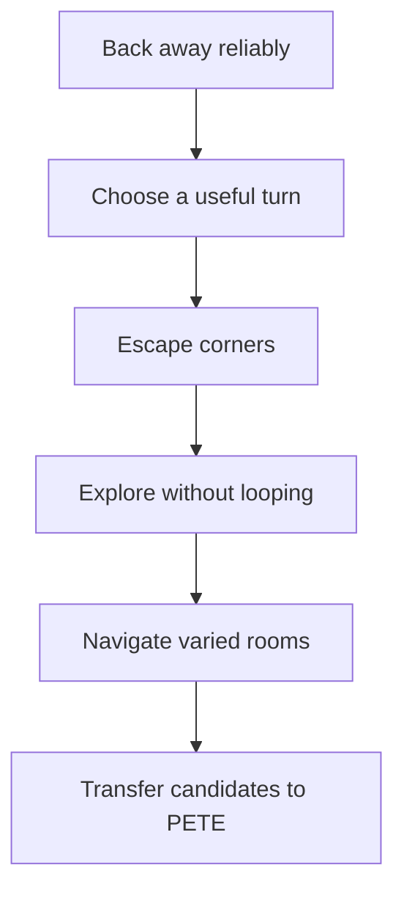

# NEAT Locomotion

`locomotion` is PETE's first deliberately small evolved behavior. Its learned
implementation id is `locomotion.neat.v0`; its ancestral implementation is
`locomotion.hardcoded_wander.v0`.

The behavior proposes motion. It does not own the body. Its output remains
below Reign/event priority and above the existing autonomic, cockpit, lease,
heartbeat, estop, cliff, wheel-drop, battery, command-bound, and brainstem
safety layers.

## Train

```bash
just train --neat locomotion
```

The command evolves a candidate, writes progress reports and WorldLab captures,
then performs a transfer audit. If the candidate's transfer fitness beats the
currently active locomotion model, or the hardcoded baseline when no model is
active, the command writes the checkpoint and promotes `locomotion` to
`model_infer` in `configs/models.toml`. The selected `Drive` still passes
through the downstream safety layers. Defaults can be changed without changing
the command contract:

```bash
PETE_NEAT_POPULATION=64 \
PETE_NEAT_GENERATIONS_PER_STAGE=20 \
PETE_NEAT_EPISODES_PER_GENOME=8 \
PETE_NEAT_STEPS=260 \
PETE_NEAT_SEED=41 \
PETE_NEAT_HELDOUT_SEED=9000001 \
just train --neat locomotion
```

Set `PETE_NEAT_NO_PROMOTE=1` to keep the old candidate-only behavior.
Use `PETE_NEAT_COMPATIBILITY_THRESHOLD`, `PETE_NEAT_TARGET_SPECIES_MIN`, and
`PETE_NEAT_TARGET_SPECIES_MAX` to tune speciation pressure.

The standard artifacts are:

- promoted checkpoint: `data/models/locomotion_neat_v0/locomotion-neat.json`;
- non-promoted candidate checkpoint: `data/reports/neat/locomotion/candidate-locomotion-neat.json`;
- generation and final reports: `data/reports/neat/locomotion/`;
- replayable champion captures: `data/captures/neat/locomotion/`.

## Curriculum



The first five stages evolve the population. The sixth is audit-only. Transfer
requires hundreds of seeded episodes, a high success rate, a low collision
rate, zero safety-invariant violations, a win over hardcode, robustness to
sensor noise and left/right motor mismatch, and a verified immediate hardcoded
fallback.

Fitness is stage-specific. The command intentionally does not optimize one
grand score from the beginning. Its reported components are new area, distance
without collision, successful escapes, trap escape-boundary crossings, progress
away from the trap mouth, collisions, repeated states, wheel motion, angular
motion, stalls, and safety vetoes.

The escape and transfer stages include seeded concave traps in multiple
orientations, corner traps, and column traps. Normal training episodes include
small randomized left/right wheel gain and motor deadband perturbations. The
transfer audit uses `PETE_NEAT_HELDOUT_SEED`; those held-out seeds are not used
for population selection.

## Nervous System

The stable v1 input order has 17 values:

1. left, right, and front bump state;
2. derived left and right wheel travel;
3. forward and angular velocity;
4. distance and time since collision;
5. recent turning direction;
6. left, front, and right range clearance;
7. the previous forward and angular command;
8. battery level;
9. recent collision rate.

Create currently exposes cumulative distance and heading rather than independent
wheel encoders. The tracker derives left/right wheel travel with the Create
wheelbase. This is explicit in the input schema so a later true encoder source
can replace the adapter without silently changing checkpoint order.

The three outputs are:

1. forward velocity;
2. angular velocity;
3. recovery activation.

Recovery activation can make the proposed linear command non-positive. It
cannot clear a brainstem safety latch, disable a reflex, extend a heartbeat, or
bypass the downstream clamps.

## Observability

Every generation prints:

- curriculum and population generation;
- species count;
- best, mean, and worst fitness;
- champion node and connection counts;
- success and collision rates;
- every decomposed fitness component.
- compatibility-threshold adjustments when species collapse or fragment outside
  the target species range.

Each generation gets a JSON report. Every configured Nth generation and every
stage champion gets a WorldLab capture with scenario metadata, topology size,
fitness, and the complete snapshot stream. Set `PETE_NEAT_CAPTURE_EVERY=1` to
capture every generation champion.

The transfer report compares the candidate with the ancestral hardcoded policy
on identical seeds, then repeats evaluation with sensor noise/latency and motor
asymmetry. `transfer_eligible=false` is a normal, useful result; the report
contains the evidence needed to decide what to evolve next.

## Runtime Promotion

`configs/models.toml` starts locomotion in `hardcoded` regime with
`use_hardcoded` fallback. The NEAT trainer may promote a candidate to
`model_infer` when it beats the current active baseline in the transfer audit.
Set `PETE_NEAT_NO_PROMOTE=1` when you want to collect candidates without
changing runtime selection.

Even in `model_infer`, autonomous `Explore` is the only action currently lowered
through this behavior. Human Reign commands and event-forced actions outrank it,
and the selected `Drive` still passes through `SimpleSafety`, the real-slow
hardware gate, cockpit possession, and brainstem enforcement.
