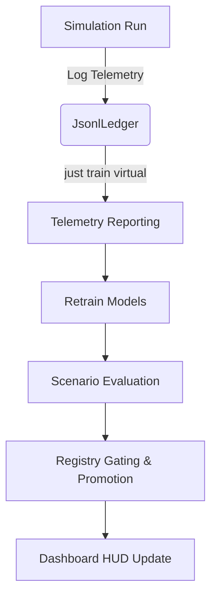

# Pete Virtual Training and Evaluation Pipeline

This document describes the automated post-run virtual training and evaluation pipeline designed to close the experience collection and behavioral learning loop.

## Overview

The virtual training pipeline automates the transition from raw simulation experience (logged in a virtual-live ledger) to verified, registered, and promoted neural behavior models.



---

## 1. Pipeline Stages

The `just train virtual` command orchestrates five consecutive stages:

1. **Reporting (`generate_virtual_report`):**
   Aggregates telemetry from the experience ledger (e.g. `data/ledger/virtual-live`). It computes:
   - Total frames and transitions.
   - Sensor coverage (eye/ear frames).
   - Trapped or stuck events.
   - Battery level delta and total duration.

2. **Training (`train_behavior`):**
   Trains selected core behavior models sequentially:
   - `danger` (Obstacle avoidance network)
   - `charge` (Charger seeking network)
   - `eye_next` (Visual prediction autoencoder)
   - `ear_next` (Audio prediction autoencoder)
   - `future` (State projection model)
   Metrics (loss, samples seen) are saved inside the checkpoint folder alongside an `evaluation.json` report.

3. **Scenario Evaluation (`run_eval_scenario`):**
   Executes headless scenario evaluations on the `MixedRoom` scenario to ensure no regressions:
   - **Baseline Run:** Evaluates the scenario with all behavior models disabled (hardcoded/off).
   - **Candidate Run:** Evaluates the scenario with the newly trained candidate models in `ShadowInfer` mode.

4. **Registry Gating & Promotion (`model_register` & `model_promote`):**
   Gathers statistics from the baseline vs candidate evaluations.
   - Every candidate is registered in `data/models/registry.json`.
   - The promotion gates verify that the candidate does not regress on success rate or collision rate.
   - **Safety-Critical Behaviors** (`danger`, `future`) are blocked from auto-promotion to `Inference` mode unless `--allow-safety-critical-inference` is explicitly supplied. They can, however, be promoted to `Shadow` mode.
   - Approved promotions are committed to the registry.

5. **Dashboard Updates:**
   Consolidates the run metrics and model statuses into `data/reports/virtual/latest.json`.
   The `pete-server` serves this report via `GET /view/training/latest`.

---

## 2. CLI Reference

### Run Virtual Training Pipeline
To run the full pipeline:
```bash
just train virtual
```
*Note: Set `PETE_LEDGER` to point to a custom ledger, and `PETE_EPOCHS` to configure training epochs (default is 5).*

### Generate Run Report Only
To generate a standalone run report from telemetry:
```bash
cargo run -p pete-tools -- virtual-report --ledger data/ledger/virtual-live --out data/reports/virtual-run.json
```

---

## 3. Safety and Promotion Gates

Promotion is strictly governed by rules defined in `pete-training`:
- **Collision Rate:** Candidate collision rate must be less than or equal to the baseline.
- **Success Rate:** Candidate success rate must be greater than or equal to the baseline.
- **Safety Gating:** Auto-promotion to active `Inference` mode is disabled for safety-critical behavior components (such as `danger`) unless explicitly overridden. This ensures models under test run safely in `Shadow` mode before taking active control.
